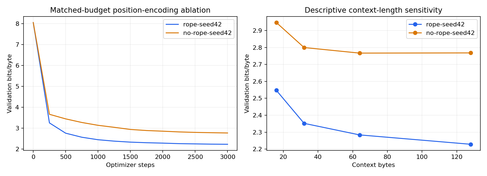

# Causal LM Lab

**Implement a decoder. Prove its information boundary. Measure what it learns.**

A 635,776-parameter byte-level language model trained from scratch on Tiny Shakespeare. The project connects decoder mechanics to measurable behavior through a matched-budget RoPE ablation and a smoothed bigram baseline.



## Measured results

| Model | Parameters | Steps | Test bits/byte ↓ | Byte perplexity ↓ |
|---|---:|---:|---:|---:|
| rope-seed42 | 635,776 | 3,000 | 2.4870 | 5.6062 |
| no-rope-seed42 | 635,776 | 3,000 | 2.8659 | 7.2898 |
| bigram, add-0.1 | 65,536 | 0 | 3.6243 | 12.3315 |

The two neural models use the same seed, architecture, batch size and 3000-step budget. Each checkpoint is selected by validation loss. The untouched test partition is evaluated after selection; the bigram uses the same target bytes. Lower is better. Byte perplexity is **not** comparable to word/BPE-token perplexity.

This is one seed on one small corpus, not a general benchmark claim. Removing RoPE removes explicit rotary position encoding; causal masking still supplies an ordering asymmetry. Longer evaluation context resets less often, so the context plot combines usable history with window-boundary effects and is descriptive.

## Architecture

- 256 UTF-8 byte tokens; no learned tokenizer or out-of-vocabulary byte.
- Three pre-normalized decoder blocks, width 128, four attention heads, context 128 bytes.
- Rotary position encoding, RMSNorm and SwiGLU; input/output embeddings are tied.
- Causal PyTorch scaled dot-product attention; next-byte targets shifted by one.
- AdamW, warmup plus cosine decay, gradient clipping and deterministic training.
- SafeTensor checkpoints with configuration and a documented byte tokenizer.

## Reproduce

```bash
python -m pip install -r requirements.txt
python -m unittest discover -s . -v
python prepare.py
python train.py --steps 3000 --name reproduction-rope --seed 42
python train.py --steps 3000 --name reproduction-no-rope --seed 42 --no-rope
```

Completed CPU runs took about 20.4 and 18.5 minutes with four threads in the recorded environment. Runtime varies by machine. Each neural run presents 12,288,000 training-byte targets sampled from 892,315 source bytes; this is repeated sampling, not 12 million unique training bytes.

## Dataset and protocol

Public-domain Shakespeare excerpts from [karpathy/char-rnn](https://github.com/karpathy/char-rnn/tree/master/data/tinyshakespeare). `prepare.py` records a pinned source revision and SHA-256 in [the manifest](data/manifest.json). The raw byte stream is split **before window generation** at fixed 80/10/10 boundaries. Training windows never cross into validation or test. These are contiguous portions of a single literary corpus, not independent documents or a semantic deduplication guarantee.

Validation selection uses fixed 128-window samples; final validation and test use all complete, non-overlapping target windows. Every model predicts the same 111,488 test target bytes. Complete windows exclude a small tail. Per-window losses, training traces, selected step, software version and sample generations are in `runs/`.

## Inspect the invariants

`test_model.py` verifies that future-input changes cannot alter prefix logits, that earlier logits have no gradient path into future input embeddings, that gradients are finite, and that checkpoint loading preserves predictions. These checks verify implementation behavior, not generalization.

## Use the released checkpoint

Weights and a model card: [Zangeeeeerange/causal-byte-lm-shakespeare](https://huggingface.co/Zangeeeeerange/causal-byte-lm-shakespeare).

```python
from huggingface_hub import snapshot_download
from model import ByteLM  # this repository's audited implementation
path = snapshot_download("Zangeeeeerange/causal-byte-lm-shakespeare",
                         allow_patterns=["model.safetensors", "config.json", "tokenizer.json"])
model = ByteLM.from_pretrained(path)
print(model.generate("ROMEO:\n", new_bytes=200, seed=42))
```

This is a custom PyTorch architecture; it does not implement Transformers `AutoModel` or hosted inference. Generation imitates local literary patterns and often produces malformed words, weak long-range coherence and repeated fragments. It has no instruction training, factuality evaluation or Kazakh-language training. No pretrained weights were used.

## Development and references

AI tools assisted implementation, experiments and documentation. The code, raw metric files and negative-control tests are available for independent inspection.

- [RoFormer / RoPE](https://arxiv.org/abs/2104.09864)
- [PyTorch scaled dot-product attention](https://docs.pytorch.org/docs/stable/generated/torch.nn.functional.scaled_dot_product_attention.html)
- [Companion: Validation Stress Lab](https://github.com/zoga228/validation-stress-lab)

Code and weights: MIT. The source corpus consists of public-domain text.
